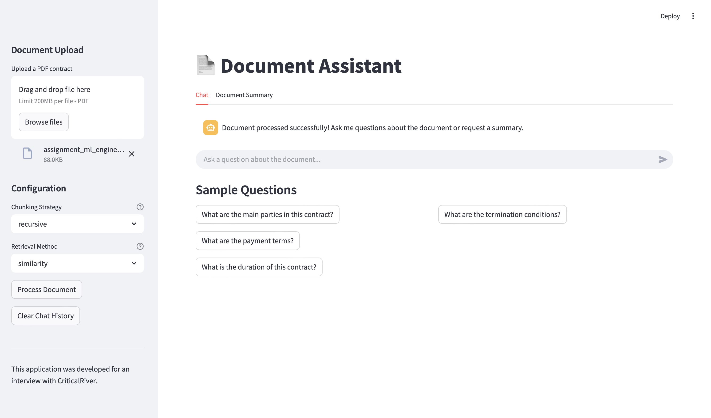
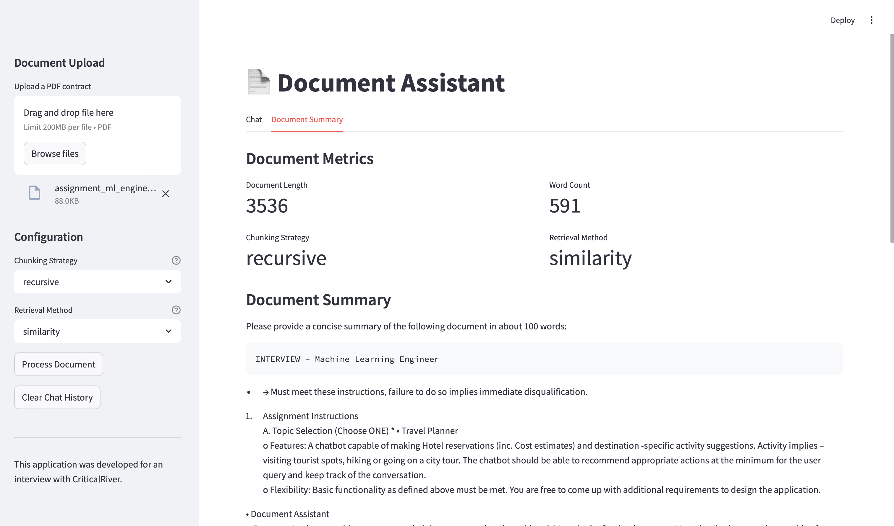
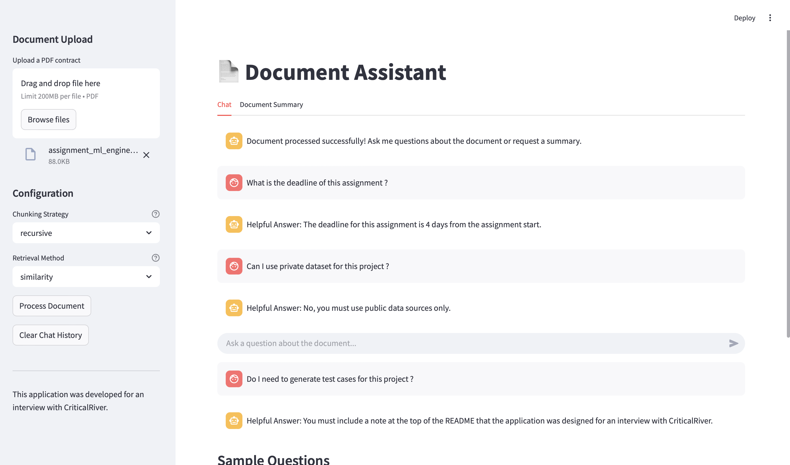
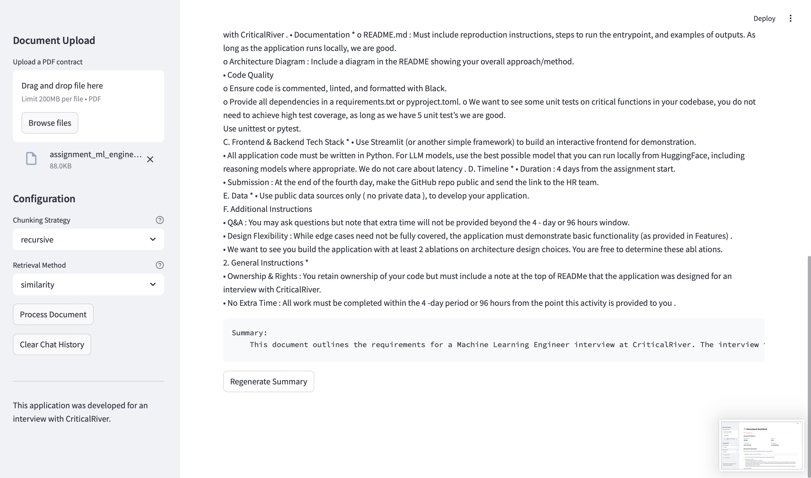

# Document Assessment Assistant

An intelligent document analysis tool built with LangChain and Streamlit that processes PDFs, provides Q&A capabilities, and generates summaries using LLM technology.


## Installation and Setup

# 1. Clone the repository
    git clone <repository-url>
    cd document-assessment-assistant

# 2. Create a virtual environment (using Make)
    make setup    
    make install-dev

# 3. Set up environment variables in .env:
    
    EMBEDDINGS_MODEL=sentence-transformers/all-MiniLM-L6-v2
    LLM_MODEL=google/flan-t5-base
    MAX_NEW_TOKENS=512
    TEMPERATURE=0.7
    HF_API_KEY=your_huggingface_api_key

# 4. Start the Stremlit UI
    make run

# 5. Testing the python code
    make test

# 6. Run all Steps
    make all    

## Output Screenshots

### Main Interface


### Document Processing


### Q&A Example


### Summary Generation


## Project Structure
```bash
.
├── document_assistant.py        # Core document processing logic
├── streamlit-chat-interface.py  # Streamlit UI
├── test-document-assistant.py   # Test cases
├── requirements.txt             # Dependencies
├── Makefile                     # Build and test automation
├── .env                         # Environment variables (not tracked)
└── bot_screenshots/             # Documentation and images
    └── images/                  # Screenshot images